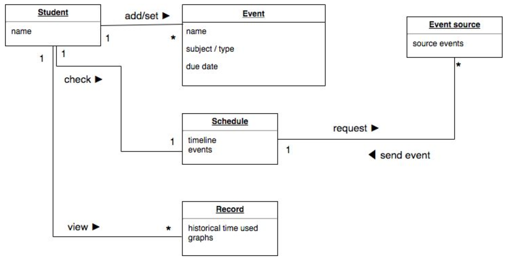

## Stakeholder interview

> Feedback from Professor: It may be hard to access and crawl the data from the websites that we want to access. Also keeping track of the duration time may be annoying, but the idea of giving recommendations is favorable. 

> Feedback from Tutor: Not sure about the difficulty of this project. However, inputting due dates manually is disturbing.

key issues:
* Feasibility of scrapping NYU Classes

## Our working stack:

Front End: React.js

Backend: Node.js, Python Flask

Other alternatives: MongoDB 

## Conclusion:

We came to a conclusion that we should test the feasibility of scrapping NYU Classes, if the plan doesn’t workout, we are still deciding for another alternative. 

## End-user observation

Persona:

A student thinks that prediction not necessary, she suggests that showing a time distribution on each class’s assignments for the week may be more ideal, just to check on our productivities. Since plans always change in our daily lives, it's hard to really estimate in an objective way. Another group of students say that they don’t mind inputting the task manually if the assignments are not from NYU classes.

## Use cases

* 
<pre> Title: Add sources  
Actor: User  
Scenario: User enters web url to crawl the assignments and their corresponding due dates. Users enter username and password for the websites. User enters keywords that identify that assignments and due dates. 
</pre>

* 
<pre>Title: Add tasks  
Actor: User  
Scenario: When not possible, user enter due dates of the assignments manually. System provides prediction about the estimated time for the task. User chooses to adopt the estimated time provided or set a new one. 
</pre>

* 
<pre>Title: Set Reminder  
Actor: User  
Scenario: User sets reminder time so that the user may get a heads up for what is to expect before the due week/date and may work on the task if the user has time. 
</pre>

* 
<pre>
Title: Start the task  
Actor: User  
Scenario: User starts the task. System pops up tips about the task basing on the user’s past behaviour of similar tasks. System begins to record the duration of the task. </pre>

* 
<pre>
Title: Mark the task as finished as time management  
Actor: User  
Scenario: User finishes the task. System records the complete time as data and predict the estimated time for similar tasks in the future. 
</pre>

* 
<pre>
Title: Categorize tasks  
Actor: User  
Scenario: User categorizes the task into different types. System can display tasks in categories. 
</pre>

* 
<pre>
Title: Check analysis  
Actor: User  
Scenario: User checks the analysis. System shows an analysis of different types of tasks so far in visualization. 
</pre>

## Domain modeling

