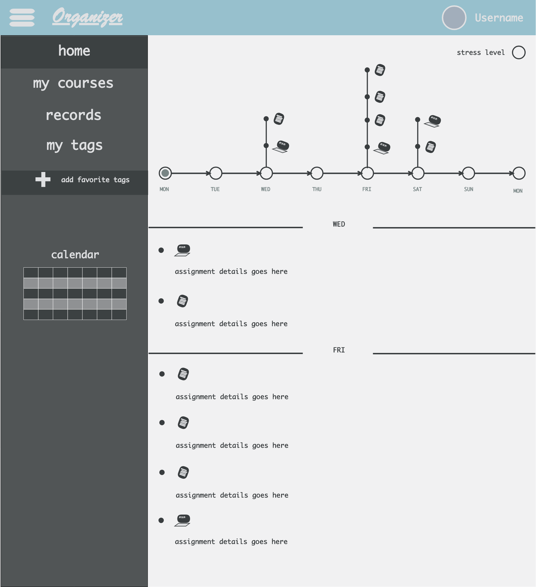
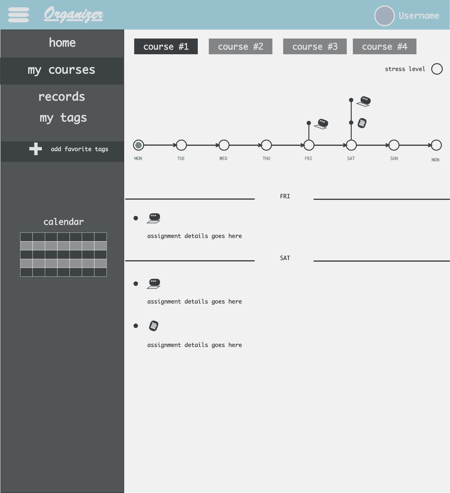
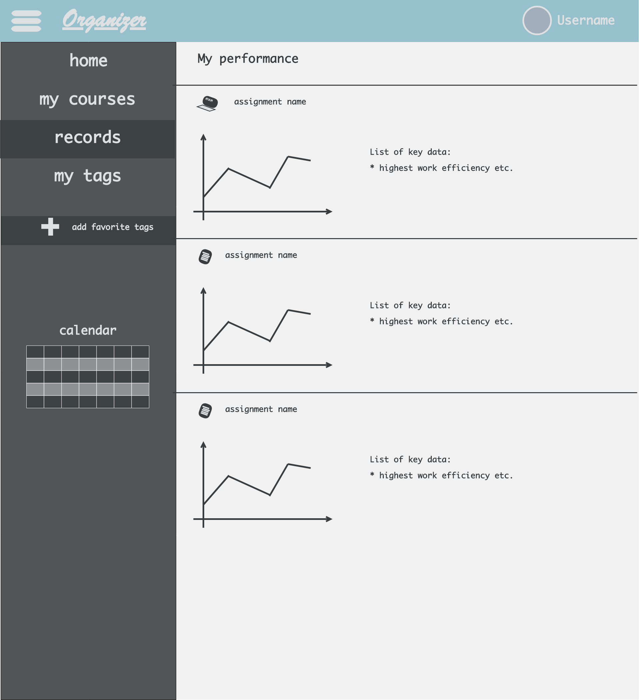

# Some notes on the mockup:

 Opacity used is 87% and 60%, pallete used is attached as pallete.pdf 

### home page

> Notes:

* a click on the calendar jumps to a specific day with assignments listed

### courses page & tags page

> Notes:

* tags are used in case a user wants to add more events other than scrapped assignments
* tags page has the same layout as the courses page shown above
* a user could bring his favorite tags to the sidebar by going to `add favorite tags`

### records page

> Notes:

* records page shows statistics collected from the user
* the detailed content is yet to be discussed

